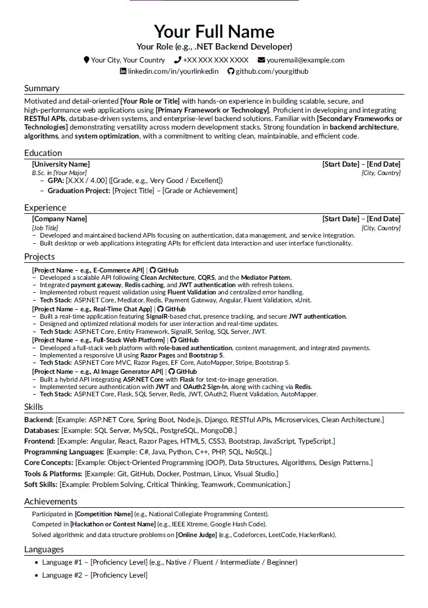

# 📄 LaTeX CV Template

A professional and elegant **CV template** built using **LaTeX**, designed for use with [Overleaf](https://www.overleaf.com/) or your local LaTeX environment.

---

## 🖼️ Preview



---

## 🚀 Getting Started

### Option 1: Overleaf
1. Go to [Overleaf](https://www.overleaf.com/).
2. Click **New Project → Upload Project**.
3. Upload all files from this repository.
4. Open `main.tex` and start editing your information.

### Option 2: Local Setup
1. Make sure you have LaTeX installed.  
   - For Windows: install [MiKTeX](https://miktex.org/download)
   - For Linux: `sudo apt install texlive-full`
   - For macOS: install [MacTeX](https://tug.org/mactex/)
2. Clone this repository:
   ```bash
   git clone https://github.com/YourUsername/CV-Template.git
   cd CV-Template
   ```
3. Compile the main file:
   ```bash
   pdflatex main.tex
   ```

---

## 🧩 Files Structure

```
.
├── resume.tex          # Main LaTeX file
├── sections/         # Folder containing CV sections (Experience, Education, etc.)
├── README.md         # This file
└── assets/           # Optional folder for icons or additional resources
```

---

## 🪄 Customization

- Update your **personal info** in `resume.tex`.
- Modify or add new sections in the `sections/` directory.
- Adjust formatting or colors from the preamble section.

---

## 📬 License

This project is open-source

